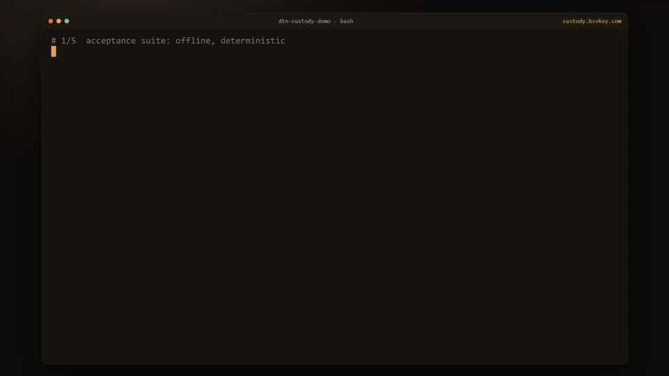

# dtn-custody-demo

[](LICENSE)



*The demo above is a real run (`npm test`, `npm run demo`, `make spike`, `make r2`, `make live`), recorded by
[`demo/record.mjs`](demo/record.mjs) and rendered by [`demo/render.mjs`](demo/render.mjs). The
closing card reads the anchor transaction live from the chain and recomputes the payload's root.*

A **reference implementation of a verifiable data-custody and relay-payment layer** for
delay/disruption-tolerant networking (DTN), with settlement on **BSV**. A chunked
payload crosses a multi-hop, occultation-interrupted link where every chunk is verified
against a Merkle root, each relay hop leaves a signed custody receipt, the blackout
produces a documented gap object, and delivery is bound to a real on-chain BSV
settlement, with the manifest root anchored on chain for provenance.

It rides standard **BPv7 (RFC 9171)** for transport (µD3TN) and adds the custody,
verification, and payment work as an application-layer agent on top, using the same
content-addressed receipt route as [`@bsvkey/x402-bsv-client`](https://www.npmjs.com/package/@bsvkey/x402-bsv-client)
and the [ASM capacity-attest](https://github.com/YE-YI7/asm-spec) work. **Out of scope,
by design:** the physical RF layer (modulation, coding, pointing, FEC).

This is published as an open reference implementation for the BSV ecosystem: the
protocol, agent library, DTN adapters, and on-chain verifiers are here under Apache-2.0
so anyone can build verifiable data-custody and relay settlement on BSV. See
[Open core vs. hosted service](#open-core-vs-hosted-service).

Full design, milestones, and acceptance criteria: [`docs/BUILD-PLAN.md`](docs/BUILD-PLAN.md).

## One-line scope
`chunk → Merkle → BPv7 bundles → multi-hop store-and-forward with a scripted
occultation → out-of-order Merkle verification → per-hop custody receipts → gap object
across the blackout → delivery bound to a real BSV settlement → provenance anchor.`

## Layout
```
agent/               the application agent
  lib/               canonical hashing, Merkle tree, keys, receipts, gap object
  source.mjs         chunk + Merkle + signed manifest
  relay.mjs          per-hop custody receipts
  dest.mjs           out-of-order verify, reassemble, chain check, settlement binding
transport/
  sim.mjs            in-process DTN simulator (delay, reorder, occultation)
  bpv7-adapter.md    the real BPv7/uD3TN + netem seam (same shape as sim.mjs)
ground/              ground-side pilot kit: station-signed ledgers from received data, no flight change
flight/              onboard signing in C (byte-identical to the test vectors)
ion/, mix/, hardy/  JPL ION, mixed uD3TN/HDTN and Aalyria Hardy interop runs
bench/               performance and overhead measurements
test/                the acceptance-criteria suite (node --test)
contact-plans/       per-tier link schedules with occultation windows
docs/                BUILD-PLAN.md (the full plan)
docker-compose.yml   the 4-node BPv7 + netem testbed (stub)
Makefile             one-command entry points
run-demo.mjs         the end-to-end demo (npm run demo)
```

## Status
The **application layer is implemented and green**, and it has been proven over real
infrastructure:
- `npm test` passes the acceptance criteria; `npm run demo` runs the full pipeline
  offline (zero dependencies).
- **M0 (`make spike` / `make spike-local`)** carries the payload over a real transport
  through an occultation: `spike-local` over real sockets, `make spike` over real veths
  with `tc netem` and a real 100%-loss L2 blackout. `make spike-moon` repeats it at
  real Earth-Moon light time (1.3 s one way on the Earth link) with a 20 s blackout.
  See `m0/RESULTS.md`.
- **R2 (`make r2`)** carries the same custody chain over **real µD3TN BPv7**, with the
  bundles **held in µD3TN storage across a scheduled contact gap** (real bundle
  custody, not TCP retransmit). See `r2/RESULTS.md`.

- **Live settlement (`make live`)** binds the delivery receipt to a **real, on-chain-
  verified BSV settlement** (WhatsOnChain): the receipt names the txid the verifier
  paid, and that txid is confirmed on chain to pay the seller. Verified against a real
  mainnet settlement (5942 sats, 2351+ conf). See `live/`.

- **Provenance anchor** is on chain: the manifest root of `live/anchored-payload.txt` is
  committed in an OP_RETURN (tx [`733dcc21…b51207`](https://whatsonchain.com/tx/733dcc21bb592ab70118fcd68f9e398dd0a51e135e0fe3570ab3ea3724b51207)),
  and `make live` verifies it by default. `buildAnchorTx` builds (never broadcasts) the
  anchor for a new root; broadcasting is the operator's step. See `live/RESULTS.md`.

- **Ground-side pilot kit (`ground/`)** signs what a ground station received, reports
  every scheduled pass (a silent pass becomes a gap record), seals the ledger under one
  root, and corroborates two stations. Runs on existing received files; no flight
  change. `node ground/demo.mjs`.

- **Onboard signing in C (`flight/`)**: the same records produced in portable C99
  with TweetNaCl Ed25519, byte-identical to the published test vectors (signatures
  included), about 11 KB of code on an ARM Cortex-M4. `make flight`.

- **Performance (`bench/`)**: about 30,000 custody receipts signed per second on one
  desktop core; custody adds about 2% at 64 KiB chunks. See `bench/RESULTS.md`.

Mission-latency contact plans (Moon, Sun-Earth L1, Mars, Uranus) ship in `contact-plans/`
and compile to the formats NASA's DTN software loads (verified end to end with NASA HDTN: our custody payload was stored by the HDTN router across a scheduled gap and verified at the receiver, see `hdtn/RESULTS.md`): HDTN (NASA Glenn) JSON and JPL ION
contact and range commands (`node contact-plans/compile.mjs <plan>`), also verified end to end with JPL ION: ION's contact graph routing held our payload across a scheduled 20 s gap and every chunk and custody handoff verified on arrival (`make ion`, see `ion/RESULTS.md`). A mixed chain also passes: uD3TN hands the payload to NASA HDTN over TCPCLv3, HDTN stores it across a scheduled gap, and delivers it to a second uD3TN node, where every chunk and handoff verifies (`make mix`, see `mix/RESULTS.md`). It also runs on Aalyria's Hardy: our agent attaches through Hardy's gRPC application and convergence-layer APIs, Hardy's time-variant routing agent (fed a contact plan from our compiler, `--hardy`) holds the payload across a scheduled gap, and every chunk verifies (`make hardy`, see `hardy/RESULTS.md`). The demo runs any of
them: `node run-demo.mjs --plan contact-plans/mars-relay.json`.

Run it:
```bash
npm test        # acceptance criteria, offline, deterministic
npm run demo    # the end-to-end pipeline with readable output
```

## Standards and heritage

This layer sits on top of a deployed, standardized transport; it does not reinvent DTN.

- **Standard.** Bundle Protocol v7 is an IETF standard: [RFC 9171](https://datatracker.ietf.org/doc/html/rfc9171),
  with BPSec (RFC 9172), default security contexts (RFC 9173), and the TCP convergence
  layer (RFC 9174), updated by RFC 9713 (2025). BPv6 was RFC 5050; the architecture is
  RFC 4838.
- **Deployed.** DTN runs operationally on the International Space Station (the DTNME
  engine), first flew in space on UK-DMC (2008), was demonstrated deep-space by NASA JPL's
  DINET (Deep Impact / EPOXI), and is used by NASA's PACE mission. This reference uses
  [µD3TN](https://gitlab.com/d3tn/ud3tn), a space-tested BPv7 implementation.
- **Heritage.** "Delay-tolerant networking" was coined by Kevin Fall (2002), out of Vint
  Cerf's Interplanetary Internet work, with ARPA/DARPA lineage.
- **The gap this fills.** BPv7 standardizes how bundles move, but defines no native
  payment, incentive, or economic model, and only limited trust verification. It does not
  say who paid for a delivery, or how to prove the custody chain offline. That settlement
  and verifiable-custody layer is what this adds, on top of the standard, not instead of it.

## Record format specification

[`spec/CUSTODY-RECORDS.md`](spec/CUSTODY-RECORDS.md) specifies the record formats (canonical JSON,
content identifiers, signatures, Merkle proofs, custody, gap and delivery records, plus the
satellite-downlink and mirror-corroborated records of the sibling projects), with test
vectors that the test suite regenerates from the code on every run.

## Acceptance criteria (what "done" means)
1. Out-of-order chunk integrity against a Merkle root; a tampered chunk is rejected.
2. A custody chain across the relays verifies (three links, two relay custody hops); a
   forged or missing hop is detected.
3. A gap object documents the occultation and reconciles on link reopen.
4. Delivery is bound to a settlement (matching txid passes, unbound refuses).
5. The manifest root is anchored on-chain and re-derives from the received payload.
6. Runs headless in CI on every push (GitHub Actions, offline suite) plus a `--live` mode
   with one real anchor.

## Open core vs. hosted service

This repository is the **open core** under Apache-2.0: the protocol, the agent library
(`agent/`), the DTN transport adapters (`transport/`, `m0/`, `r2/`), the verifiers, and
the live on-chain checks (`live/`). Use it, fork it, build on it.

What is **not** in this repository and is not covered by this license: a hosted BSV
settlement facilitator and relay marketplace, managed key custody, enterprise and
compliance features, and the BSVKey brand. Those are operated separately. The open core
settles on BSV; running a production relay-payment service on top of it is where the
hosted offering lives.

## Contributing and security

See [`CONTRIBUTING.md`](CONTRIBUTING.md) and [`SECURITY.md`](SECURITY.md). The keys and
funds in any live path are yours; this reference implementation never holds them.

---
Copyright 2026 Embryo Space Inc. (DBA BSVKey). Licensed under the Apache License 2.0.
See [`LICENSE`](LICENSE) and [`NOTICE`](NOTICE).
